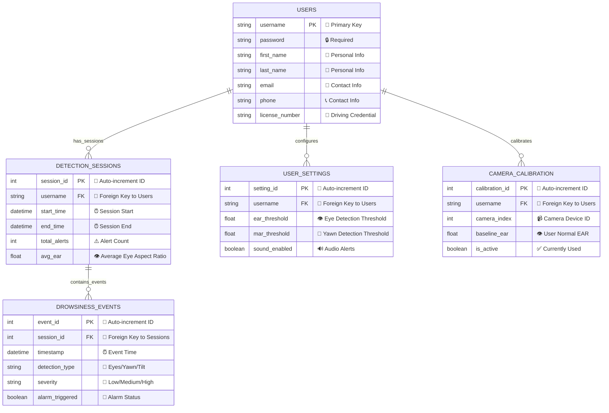

# Entity-Relationship Diagram for Drowsiness Detection System

## Database Schema ER Diagram with Geometric Shapes

### Shape Legend
- **Rectangle** 📦 - Entities (Tables)
- **Ellipse** 🥚 - Attributes (Fields)
- **Circle** ⭕ - Weak Entities or Special Attributes
- **Diamond** 💎 - Relationships



## Geometric Shape Representation

### 📦 **RECTANGLES - ENTITIES**
All main entities are represented as rectangles:

1. **USERS** 
   - Color: Blue theme
   - Contains user authentication and personal information

2. **DETECTION_SESSIONS**
   - Color: Purple theme
   - Tracks individual monitoring sessions

3. **DROWSINESS_EVENTS**
   - Color: Red theme
   - Records specific drowsiness incidents

4. **USER_SETTINGS**
   - Color: Green theme
   - Stores user preferences and thresholds

5. **CAMERA_CALIBRATION**
   - Color: Orange theme
   - Manages camera setup and baselines

### 🥚 **ELLIPSES - ATTRIBUTES**
Key attributes are represented as ellipses:
- **Primary Keys**: Yellow ellipses with bold borders
- **Foreign Keys**: Blue ellipses
- **Regular Attributes**: Gray ellipses

### 💎 **DIAMONDS - RELATIONSHIPS**
Relationship connections are marked with diamond shapes:
- **has_sessions**: USERS → DETECTION_SESSIONS
- **configures**: USERS → USER_SETTINGS  
- **calibrates**: USERS → CAMERA_CALIBRATION
- **contains_events**: DETECTION_SESSIONS → DROWSINESS_EVENTS

### ⭕ **CIRCLES - SPECIAL ELEMENTS**
Circles represent:
- Weak entities (if any)
- Composite attributes
- Multi-valued attributes

## Entity Details

### 📦 USERS (Rectangle - Blue)
```
┌─────────────────────────┐
│         USERS           │
├─────────────────────────┤
│ 🔑 username (PK)        │
│ 🔒 password             │
│ 👤 first_name           │
│ 👤 last_name            │
│ 📧 email                │
│ 📞 phone                │
│ 🚗 license_number       │
└─────────────────────────┘
```

### 📦 DETECTION_SESSIONS (Rectangle - Purple)
```
┌─────────────────────────┐
│   DETECTION_SESSIONS    │
├─────────────────────────┤
│ 🔑 session_id (PK)      │
│ 🔗 username (FK)        │
│ ⏰ start_time           │
│ ⏰ end_time             │
│ ⚠️ total_alerts         │
│ 👁️ avg_ear             │
└─────────────────────────┘
```

### 📦 DROWSINESS_EVENTS (Rectangle - Red)
```
┌─────────────────────────┐
│   DROWSINESS_EVENTS     │
├─────────────────────────┤
│ 🔑 event_id (PK)        │
│ 🔗 session_id (FK)      │
│ ⏰ timestamp            │
│ 🎯 detection_type       │
│ 🚨 severity             │
│ 🔔 alarm_triggered      │
└─────────────────────────┘
```

### 📦 USER_SETTINGS (Rectangle - Green)
```
┌─────────────────────────┐
│     USER_SETTINGS       │
├─────────────────────────┤
│ 🔑 setting_id (PK)      │
│ 🔗 username (FK)        │
│ 👁️ ear_threshold        │
│ 👄 mar_threshold        │
│ 🔊 sound_enabled        │
└─────────────────────────┘
```

### 📦 CAMERA_CALIBRATION (Rectangle - Orange)
```
┌─────────────────────────┐
│   CAMERA_CALIBRATION    │
├─────────────────────────┤
│ 🔑 calibration_id (PK)  │
│ 🔗 username (FK)        │
│ 📹 camera_index         │
│ 👁️ baseline_ear         │
│ ✅ is_active            │
└─────────────────────────┘
```

## Relationship Diamonds

### 💎 has_sessions
```
USERS ────💎────► DETECTION_SESSIONS
        has_sessions
          (1:N)
```

### 💎 contains_events
```
DETECTION_SESSIONS ────💎────► DROWSINESS_EVENTS
                 contains_events
                     (1:N)
```

### 💎 configures
```
USERS ────💎────► USER_SETTINGS
      configures
        (1:N)
```

### 💎 calibrates
```
USERS ────💎────► CAMERA_CALIBRATION
      calibrates
        (1:N)
```

## System Data Flow

1. **👤 User Registration** → Creates record in USERS rectangle
2. **⚙️ Configuration Setup** → Populates USER_SETTINGS rectangle
3. **📹 Camera Setup** → Fills CAMERA_CALIBRATION rectangle
4. **🟢 Start Session** → New record in DETECTION_SESSIONS rectangle
5. **🚨 Detection Events** → Multiple records in DROWSINESS_EVENTS rectangle
6. **📊 Session End** → Updates DETECTION_SESSIONS with summary

---

*This ER diagram uses traditional geometric shapes to represent different database elements, making it easy to understand the structure and relationships in the drowsiness detection system.*
